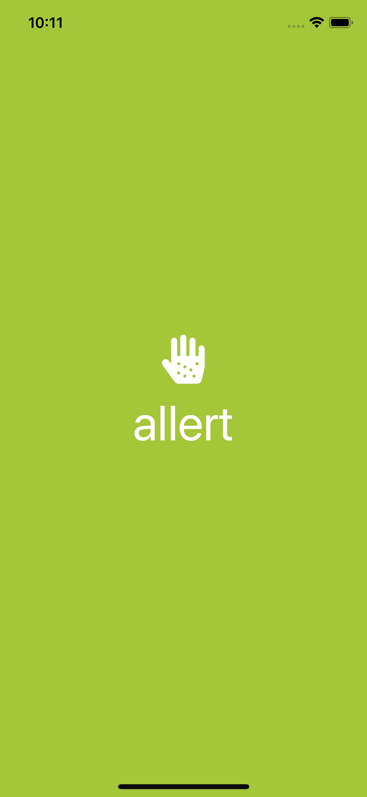
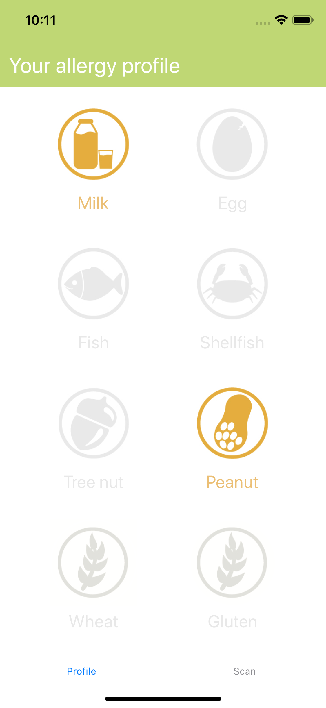
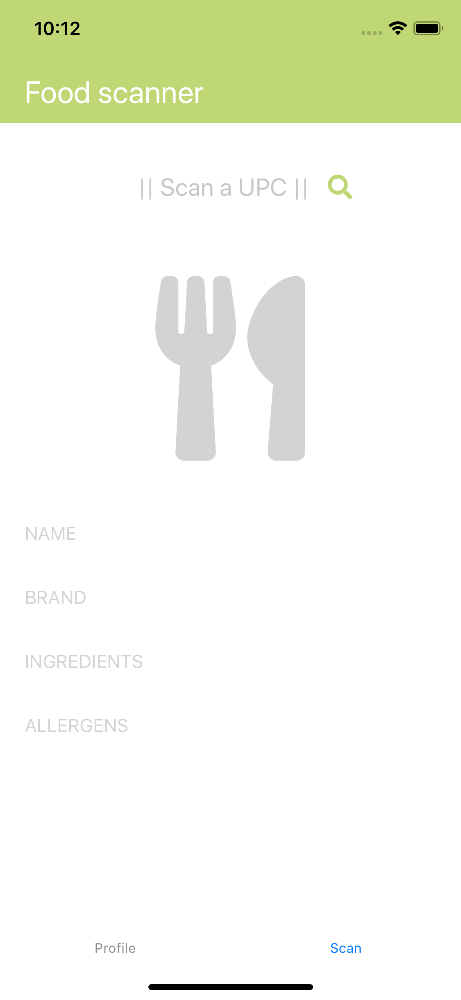
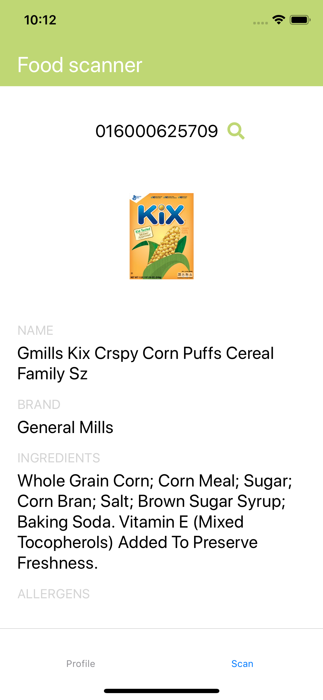
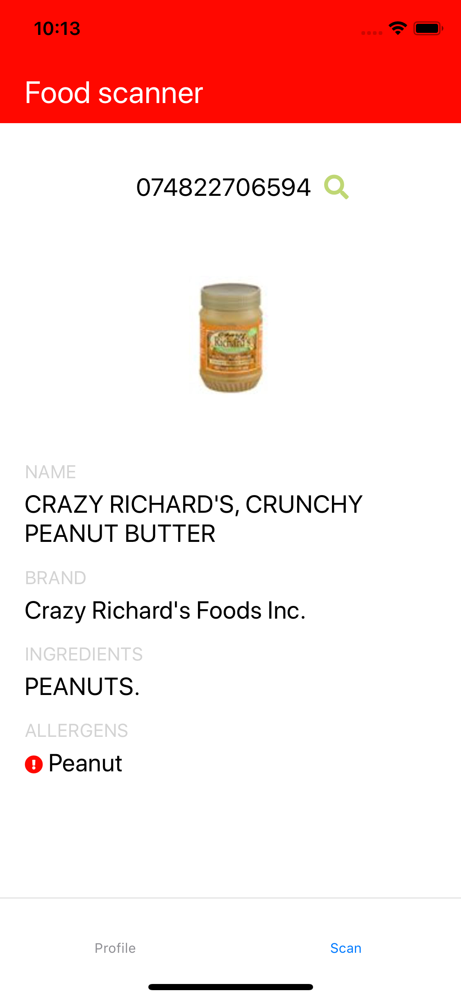

# Allert

A lightweight mobile prototype app that allows users to create a personalized food allergy profile and scan UPC-labelled products to quickly detect the presence of these allergens. Native mobile development using [React Native](https://facebook.github.io/react-native/docs/getting-started), utilizing AsyncStorage for persistent storage of allergy profile, Axios for HTTP calls, and the [Edamam Food Database API](https://developer.edamam.com/food-database-api) for product and allergy information.

  
  
  
  
  

